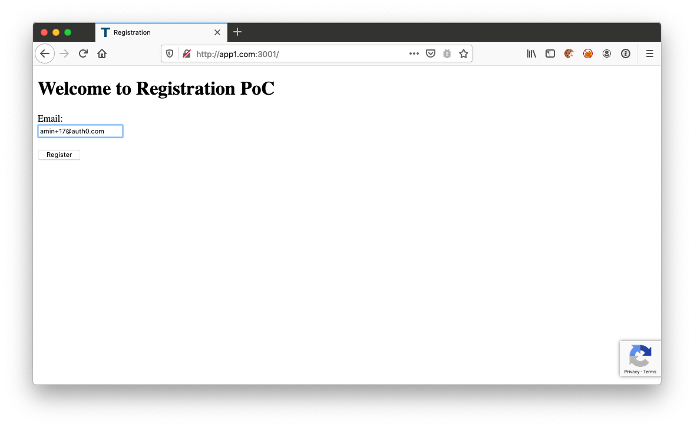
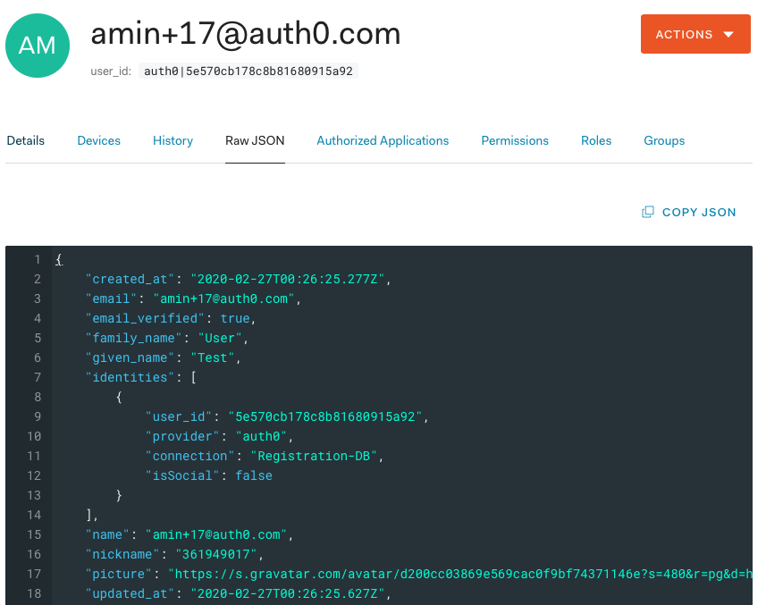

# Sample App to register with email verification

Auth0 requires users to reauthenticate after verifying their emails. 
That is the most secure approach; however, sometimes this policy does not align with the UX flow of customers that:
 
(a) want to enforce email validation as a registration step
(b) want to allow customers to continue registration without re-authenticating after email verification 

Here we propose a simple workaround using newly announced [server-side passwordless](https://auth0.com/docs/api/authentication#authenticate-user) 
flow + `/co/authenticate` to achieve above scenario.

Benefits of the following solution:

1. Passwordless connection is only allowed to a companion registration, app and not to the main application
2. Flows are simple. No complex Rules logic
3. Database connection is closed to sign up. Users created only after successful email verify
4. Magic link TTL is configurable (not limited to 20m as per Rules redirect model)
5. If state/nonce check relaxed, solution works cross browser (T&C applied)
6. MAU is low (only 1 additional Passwordless user for initial registration)
7. Invisible CAPTCHA protected 
8. Higher rate limit for /passwordless/start (Auth0-FF TBA)    
9. Works for both SPA and RWA companion apps              

### Sequence Diagram


## Setup
1. Register a RWA client in Auth0

2. Configure callback and CORS URLs

3. Add implicit and M2M grants to your App

4. Add DB connection to App 

5. Add Passwordless Email to App 

6. Add Management API with following scopes to your clients:
    `users:create`, `users:delete`, `users:read`

7. (Optional) [register](https://www.google.com/recaptcha/admin/create) a Google reCAPTCHA v3 account


8. Copy `env-sample` to `.env` and update client information
9. Copy `env.js-sample` to `env.js` and update client information 


## Running
Clone the project first.

```bash
$ cat /etc/hosts | grep app1.com
127.0.0.1  app1.com

$ composer install

$ php -S app1.com:3001 -e 
```

### Screenshots  
1. User visit http://app1.com:3001



2. Check Mailbox

  
3. Enter name, password and other details

  
4. Success


5. User Profile

  

