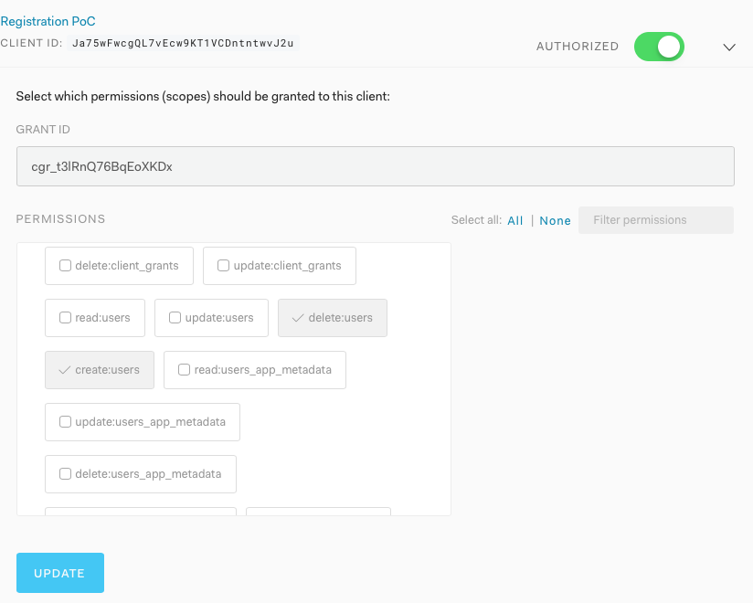

Sample App to register with email verification


## Setup
1. Register a RWA client in Auth0

2. Configure callback and CORS URLs

3. Add implicit and M2M grants to your App

4. Add DB connection to App 

5. Add Passwordless Email to App 

6. Add Management API with following scopes to your clients:
    `users:create`, `users:delete`

7. (Optional) [register](https://www.google.com/recaptcha/admin/create) a Google reCAPTCHA v3 account


8. Copy `env-sample` to `.env` and update client information
9. Copy `env.js-sample` to `env.js` and update client information 


## Running
Clone the project first.

```bash
$ cat /etc/hosts | grep app1.com
127.0.0.1  app1.com

$ compose install

$ php -S app1.com:3001 -e 
```

### Sequence Diagram


### Screenshots  
1. User visit http://app1.com:3001


2. Check Mailbox

  
3. Enter name, password and other details

  
4. Success


5. User Profile

  

